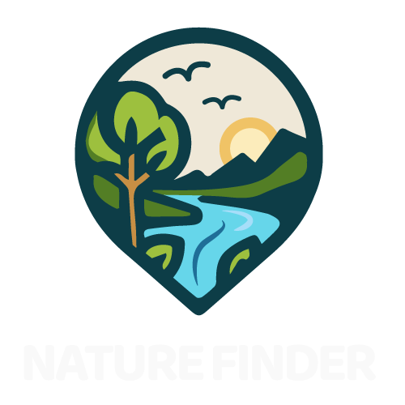

<<<<<<< HEAD
<p align="center">
  
</p>

=======




# Nature Finder
>>>>>>> 87c86f39a0c63ac7f31210525db6de0a42f48139

O Nature Finder é uma plataforma que permite explorar e contribuir para a preservação da natureza, fornecendo acesso a informações sobre áreas naturais, trilhas, parques ecológicos, reservas ambientais e outros locais de interesse para os amantes da natureza.

Através do Nature Finder é possível

* Cadastrar perfis de usuário;
* Cadastrar locais da natureza;
* Descrev dos locais da natureza;
* Registro dos locais em mapa, através de geolocalização, com busca por CEP;
* Visualizar e interagir com o minimapa.

<<<<<<< HEAD
# Rodando a aplicação

## Rodando na Web

Acesse o link abaixo:

https://natuclone.vercel.app/


## Rodando localmente
=======
# Rodando localmente
>>>>>>> 87c86f39a0c63ac7f31210525db6de0a42f48139

Para realizar os testes da plataforma, será necessário o uso de uma plataforma de edição de códigos (recomendado VS Code).

Através do terminal, seguir os seguintes passos:

Clone o projeto

```bash
<<<<<<< HEAD
  git clone https://github.com/FuturoDEV-Nature/M3P-FrontEnd-Squad1.git
=======
  git clone https://github.com/diegocmps/nat365Front.git
>>>>>>> 87c86f39a0c63ac7f31210525db6de0a42f48139
```

Instale as dependências

```bash
  npm install
```

Inicie o servidor

```bash
  npx json-server database.json
```

Inicie o projeto

```bash
    npm run dev
```

Ao iniciar o projeto, aparecerá no terminal um link para acesso à plataforma:

http://localhost:5173/

<<<<<<< HEAD
=======
Também é possível acessar o projeto através do Vercel, através do link:

https://natureza365.vercel.app/

OBS: Como a plataforma depende do json-server em funcionamento, não é possível realizar os testes através do celular, podendo utilizar normalmente no computador, através de um navegador web.

# Vídeo

Você pode assistir a apresentação do projeto através do link:

https://youtu.be/TJ-eBIEYqJ0
>>>>>>> 87c86f39a0c63ac7f31210525db6de0a42f48139


# Demonstração

<<<<<<< HEAD
## Dashboard

<p align="center">

</p>

## Imagem de Locais cadastrados

<p align="center">

</p>

## Cadastro de Locais

<p align="center">

</p>

## Zoom no minimapa

<p align="center">

</p>
=======
## Login/Senha


## Cadastro


## Dashboard


## Imagem de Locais cadastrados


## Cadastro de Locais


## Zoom no minimapa


>>>>>>> 87c86f39a0c63ac7f31210525db6de0a42f48139


## Modo Responsivo

É possível utilizar a plataforma Nature Finder através de celulares, pois a plataforma possui modo responsivo.

<<<<<<< HEAD
<p align="center">

</p>
=======


>>>>>>> 87c86f39a0c63ac7f31210525db6de0a42f48139

## Melhorias

Para futuras versões da plataforma, poderão ser aplicadas as seguintes melhorias:

<<<<<<< HEAD
      1. Inserção de galeria de imagens do local;
      2. Opção de compartilhamento de conteúdo em redes sociais;
      3. Registro de espécies de plantas e animais encontrados no local;
      4. Inclusão de guias e trilhas, fornecendo informações mais detalhadas sobre cada local;
      5. Lista de eventos e atividades realizadas nos locais;
      6. Notificações e alertas;
      7. Maior interação no mapa, apresentando os trajetos das trilhas.
=======
      1. Integração com api de back-end;
      2. Inserção de galeria de imagens do local;
      3. Opção de compartilhamento de conteúdo em redes sociais;
      4. Registro de espécies de plantas e animais encontrados no local;
      5. Inclusão de guias e trilhas, fornecendo informações mais detalhadas sobre cada local;
      6. Lista de eventos e atividades realizadas nos locais;
      7. Notificações e alertas;
      8. Maior interação no mapa, apresentando os trajetos das trilhas.
>>>>>>> 87c86f39a0c63ac7f31210525db6de0a42f48139
 


## Stack utilizada

**Front-end:** 

<<<<<<< HEAD
[](https://developer.mozilla.org/docs/Web/HTML)
[](https://developer.mozilla.org/docs/Web/CSS)
[](https://developer.mozilla.org/docs/Web/JavaScript)

[](https://react.dev/) 
[](https://vitejs.dev/guide/)

[](https://reactrouter.com/en/main) 
[](https://react-hook-form.com/) 
[](https://react-leaflet.js.org/) 

[](https://www.npmjs.com/package/axios) 
[](https://www.npmjs.com/package/json-server) 

[](https://eslint.org/) 
[](https://sass-lang.com/)
=======
Construção da plataforma através de HTML, Javascript e CSS utilizando as seguintes bibliotecas:


- [React](https://react.dev/) - para construção da interface do usuário.
- [Vite](https://vitejs.dev/guide/)
- [React Router DOM](https://reactrouter.com/en/main) - para navegação.
- [React Hook Form](https://react-hook-form.com/) - para gerenciamento de formulários.
- [React Leaflet](https://react-leaflet.js.org/) - para mapas interativos.
- [Axios](https://www.npmjs.com/package/axios) - para requisições HTTP.
- [JSON Server](https://www.npmjs.com/package/json-server) - para simulação de uma API REST.
- [ESLint](https://eslint.org/) - para garantir a qualidade do código.
- [Sass](https://sass-lang.com/) - para pré-processamento de CSS.


## Documentação de cores

| Hexadecimal                                                |
| ---------------------------------------------------------------- |
|  #009879 |
|  #31cdad |
|  #d00000 |
|  #fbff17 |
|  #0078a8 |
|  #38f |
>>>>>>> 87c86f39a0c63ac7f31210525db6de0a42f48139


## Autores

- [@diegocmps](https://github.com/diegocmps)

<<<<<<< HEAD
- [@JosehKunz](https://github.com/JosehKunz)

- [@HerbCyor](https://github.com/HerbCyor)

- [@TalineAraujo](https://github.com/TalineAraujo)

=======
  - Github: https://github.com/diegocmps
  - Linkedin: https://www.linkedin.com/in/diego-campos-8b97784b/
>>>>>>> 87c86f39a0c63ac7f31210525db6de0a42f48139


# Comentários e Agradecimentos

<<<<<<< HEAD
Este projeto foi realizado em Squad como trabalho de conclusão do Módulo 3 do Curso FuturoDEV Nature, do [Floripa Mais Tec](https://floripamaistec.pmf.sc.gov.br/).

O Floripa Mais Tec é um projeto realizado pelo [LAB365](https://lab365.tech/), uma extensão do SENAI/SC em parceria com a Prefeitura de Florianópolis.

Agradecemos à toda a equipe do LAB365 pelo suporte durante a realização do curso, em especial ao professor deste módulo: [Bruno Costa](https://github.com/bruno-Costa-fig)
=======
Este projeto foi realizado individualmente como trabalho de conclusão do Módulo 2 do Curso FuturoDEV Nature, do [Floripa Mais Tec](https://floripamaistec.pmf.sc.gov.br/).

O Floripa Mais Tec é um projeto realizado pelo [LAB365](https://lab365.tech/), uma extensão do SENAI/SC em parceria com a Prefeitura de Florianópolis.

Agradeço à toda a equipe do LAB365 pelo suporte durante a realização do curso, em especial aos professores deste módulo:

* [Nicholas Macedo](https://github.com/nicholasmacedoo)
* [Yan Esteves](https://github.com/yanesteves)


Agradeço também aos alunos das turmas FuturoDEV Nature e Trip, pela parceria durante esta jornada. 
>>>>>>> 87c86f39a0c63ac7f31210525db6de0a42f48139
